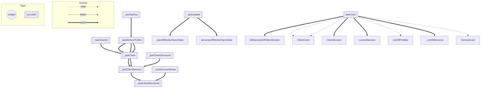
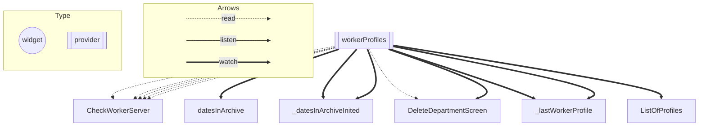
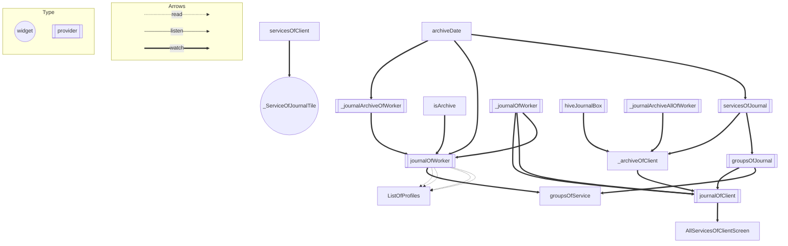
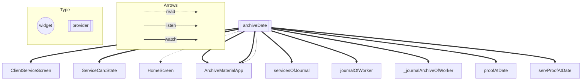

# Providers - Providers of App

```mermaid
flowchart TB        
  subgraph Arrows
    direction LR
    start1[ ] -..->|read| stop1[ ]
    style start1 height:0px;
    style stop1 height:0px;
    start2[ ] --->|listen| stop2[ ]
    style start2 height:0px;
    style stop2 height:0px; 
    start3[ ] ===>|watch| stop3[ ]
    style start3 height:0px;
    style stop3 height:0px; 
  end
  subgraph Type
    direction TB
    ConsumerWidget((widget));
    Provider[[provider]];
  end
   _lastApiKey[[_lastApiKey]];
  _lastApiKey ==> _lastWorkerProfile;
  _lastClientId ==> _lastClient;
  _lastClientId[[_lastClientId]];
  _lastClient[[_lastClient]];
  _lastClient ==> _lastClientService;
  _lastClient ==> _lastClientService;
  _lastClientServiceAt[[_lastClientServiceAt]];
  _lastClientServiceId ==> _lastClientService;
  _lastClientServiceId[[_lastClientServiceId]];
  _lastClientService[[_lastClientService]];
  _lastClientService ==> _lastClientServiceAt;
  _lastServiceAtDate ==> _lastClientServiceAt;
  _lastServiceAtDate[[_lastServiceAtDate]];
  _lastUpdate[[_lastUpdate]];
  _lastUpdate ==> planOfWorkerSyncDate;
  _lastUpdate ==> servicesOfWorkerSyncDate;
  lastUsed ==> AllServicesOfClientScreen;
  lastUsed -.-> ClientCard;
  lastUsed -.-> ClientCard;
  lastUsed ==> ClientScreen;
  lastUsed ==> currentService;
  lastUsed[[lastUsed]];
  lastUsed -.-> ListOfProfiles;
  lastUsed ==> _ListOfServices;
  lastUsed -.-> ServiceCard;
  _lastWorkerProfile ==> _lastClient;
  _lastWorkerProfile ==> _lastClient;
  _lastWorkerProfile ==> _lastClient;
  _lastWorkerProfile[[_lastWorkerProfile]];

```

```mermaid
flowchart TB        
  subgraph Arrows
    direction LR
    start1[ ] -..->|read| stop1[ ]
    style start1 height:0px;
    style stop1 height:0px;
    start2[ ] --->|listen| stop2[ ]
    style start2 height:0px;
    style stop2 height:0px; 
    start3[ ] ===>|watch| stop3[ ]
    style start3 height:0px;
    style stop3 height:0px; 
  end
  subgraph Type
    direction TB
    ConsumerWidget((widget));
    Provider[[provider]];
  end
    workerProfiles -.-> CheckWorkerServer;
  workerProfiles -.-> CheckWorkerServer;
  workerProfiles -.-> CheckWorkerServer;
  workerProfiles -.-> CheckWorkerServer;
  workerProfiles -.-> CheckWorkerServer;
  workerProfiles ==> datesInArchive;
  workerProfiles ==> _datesInArchiveInited;
  workerProfiles ==> _datesInArchiveInited;
  workerProfiles -.-> DeleteDepartmentScreen;
  workerProfiles ==> DeleteDepartmentScreen;
  workerProfiles ==> _lastWorkerProfile;
  workerProfiles ==> _lastWorkerProfile;
  workerProfiles ==> ListOfProfiles;
  workerProfiles[[workerProfiles]];
```

```mermaid
flowchart TB        
  subgraph Arrows
    direction LR
    start1[ ] -..->|read| stop1[ ]
    style start1 height:0px;
    style stop1 height:0px;
    start2[ ] --->|listen| stop2[ ]
    style start2 height:0px;
    style stop2 height:0px; 
    start3[ ] ===>|watch| stop3[ ]
    style start3 height:0px;
    style stop3 height:0px; 
  end
  subgraph Type
    direction TB
    ConsumerWidget((widget));
    Provider[[provider]];
  end
  clientsOfWorker ==> ClientScreen;
  workerProfiles ==> DeleteDepartmentScreen;
  workerProfiles -.-> DeleteDepartmentScreen;
  workerProfiles ==> ListOfProfiles;
  journalOfWorker -.-> ListOfProfiles;
  journalOfWorker -.-> ListOfProfiles;
  journalOfWorker -.-> ListOfProfiles;
  journalOfWorker -.-> ListOfProfiles;
  CheckWorkerServer((CheckWorkerServer));
  _httpFuture ==> CheckWorkerServer;
  _httpFuture ==> CheckWorkerServer;
  _httpFuture ==> CheckWorkerServer;
  _httpFuture ==> CheckWorkerServer;
  _httpFuture ==> CheckWorkerServer;
  _httpFuture ==> CheckWorkerServer;
  _httpFuture ==> CheckWorkerServer;
  _httpFuture ==> CheckWorkerServer;
  workerProfiles -.-> CheckWorkerServer;
  workerProfiles -.-> CheckWorkerServer;
  workerProfiles -.-> CheckWorkerServer;
  workerProfiles -.-> CheckWorkerServer;
  workerProfiles -.-> CheckWorkerServer;
  planOfWorker ==> servicesOfClient;
  servicesOfWorker ==> servicesOfClient;
  planOfWorker[[planOfWorker]];
  httpDataProvider ==> planOfWorker;
  httpDataProvider ==> planOfWorker;
  servicesOfWorker[[servicesOfWorker]];
  httpDataProvider ==> servicesOfWorker;
  httpDataProvider ==> servicesOfWorker;
  journalOfWorker ==> groupsOfService;
  journalOfWorker[[journalOfWorker]];
  isArchive ==> journalOfWorker;
  archiveDate ==> journalOfWorker;
  _journalArchiveOfWorker ==> journalOfWorker;
  _journalOfWorker ==> journalOfWorker;
  _journalArchiveOfWorker[[_journalArchiveOfWorker]];
  archiveDate ==> _journalArchiveOfWorker;
  _journalOfWorker[[_journalOfWorker]];
  _journalOfWorker ==> journalOfClient;
  _journalOfWorker ==> journalOfClient;
  _journalArchiveAllOfWorker ==> _archiveOfClient;
  _journalArchiveAllOfWorker[[_journalArchiveAllOfWorker]];
  workerProfiles ==> datesInArchive;
  workerProfiles[[workerProfiles]];
  workerProfiles ==> _datesInArchiveInited;
  workerProfiles ==> _datesInArchiveInited;
  _lastWorkerProfile ==> _lastClient;
  clientsOfWorker ==> _lastClient;
  _lastWorkerProfile ==> _lastClient;
  clientsOfWorker ==> _lastClient;
  _lastWorkerProfile ==> _lastClient;
  _lastWorkerProfile[[_lastWorkerProfile]];
  workerProfiles ==> _lastWorkerProfile;
  _lastApiKey ==> _lastWorkerProfile;
  workerProfiles ==> _lastWorkerProfile;
  clientsOfWorker[[clientsOfWorker]];
  httpDataProvider ==> clientsOfWorker;
  httpDataProvider ==> clientsOfWorker;
  planOfWorkerSyncDate[[planOfWorkerSyncDate]];
  _lastUpdate ==> planOfWorkerSyncDate;
  servicesOfWorkerSyncDate[[servicesOfWorkerSyncDate]];
  _lastUpdate ==> servicesOfWorkerSyncDate;

```

```mermaid
flowchart TB        
  subgraph Arrows
    direction LR
    start1[ ] -..->|read| stop1[ ]
    style start1 height:0px;
    style stop1 height:0px;
    start2[ ] --->|listen| stop2[ ]
    style start2 height:0px;
    style stop2 height:0px; 
    start3[ ] ===>|watch| stop3[ ]
    style start3 height:0px;
    style stop3 height:0px; 
  end
  subgraph Type
    direction TB
    ConsumerWidget((widget));
    Provider[[provider]];
  end
  journalOfWorker -.-> ListOfProfiles;
  journalOfWorker -.-> ListOfProfiles;
  journalOfWorker -.-> ListOfProfiles;
  journalOfWorker -.-> ListOfProfiles;
  journalOfClient ==> AllServicesOfClientScreen;
  _ServiceOfJournalTile((_ServiceOfJournalTile));
  servicesOfClient ==> _ServiceOfJournalTile;
  servicesOfJournal[[servicesOfJournal]];
  archiveDate ==> servicesOfJournal;
  groupsOfJournal[[groupsOfJournal]];
  servicesOfJournal ==> groupsOfJournal;
  journalOfWorker ==> groupsOfService;
  groupsOfJournal ==> groupsOfService;
  journalOfWorker[[journalOfWorker]];
  isArchive ==> journalOfWorker;
  archiveDate ==> journalOfWorker;
  _journalArchiveOfWorker ==> journalOfWorker;
  _journalOfWorker ==> journalOfWorker;
  _journalArchiveOfWorker[[_journalArchiveOfWorker]];
  archiveDate ==> _journalArchiveOfWorker;
  _journalOfWorker[[_journalOfWorker]];
  journalOfClient[[journalOfClient]];
  _journalOfWorker ==> journalOfClient;
  groupsOfJournal ==> journalOfClient;
  _archiveOfClient ==> journalOfClient;
  _journalOfWorker ==> journalOfClient;
  hiveJournalBox ==> _archiveOfClient;
  _journalArchiveAllOfWorker ==> _archiveOfClient;
  servicesOfJournal ==> _archiveOfClient;
  hiveJournalBox[[hiveJournalBox]];
  _journalArchiveAllOfWorker[[_journalArchiveAllOfWorker]];
```

```mermaid
flowchart TB        
  subgraph Arrows
    direction LR
    start1[ ] -..->|read| stop1[ ]
    style start1 height:0px;
    style stop1 height:0px;
    start2[ ] --->|listen| stop2[ ]
    style start2 height:0px;
    style stop2 height:0px; 
    start3[ ] ===>|watch| stop3[ ]
    style start3 height:0px;
    style stop3 height:0px; 
  end
  subgraph Type
    direction TB
    ConsumerWidget((widget));
    Provider[[provider]];
  end
  archiveDate ==> ClientServiceScreen;
  archiveDate ==> ServiceCardState;
  archiveDate -.-> HomeScreen;
  archiveDate ==> ArchiveMaterialApp;
  archiveDate ==> ArchiveMaterialApp;
  archiveDate -.-> ArchiveMaterialApp;
  archiveDate ==> servicesOfJournal;
  archiveDate[[archiveDate]];
  archiveDate ==> journalOfWorker;
  archiveDate ==> _journalArchiveOfWorker;
  archiveDate ==> proofAtDate;
  archiveDate ==> servProofAtDate;
```