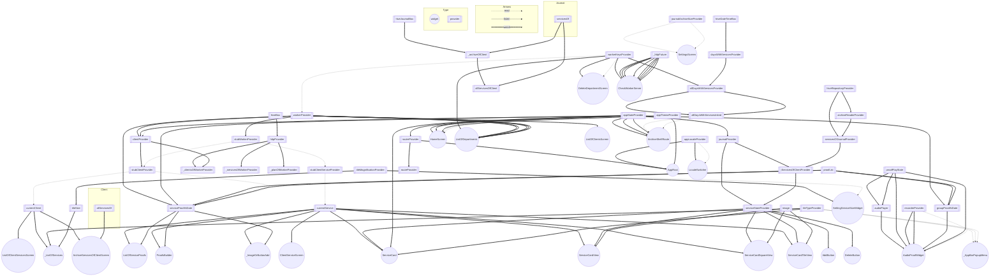

# Top level Providers of App

```mermaid
flowchart TB
  subgraph Arrows
    direction LR
    start1[ ] -..->|read| stop1[ ]
    style start1 height:0px;
    style stop1 height:0px;
    start2[ ] --->|listen| stop2[ ]
    style start2 height:0px;
    style stop2 height:0px;
    start3[ ] ===>|watch| stop3[ ]
    style start3 height:0px;
    style stop3 height:0px;
  end
  subgraph Type
    direction TB
    ConsumerWidget((widget));
    Provider[[provider]];
  end

  allDaysWithServicesInited[["allDaysWithServicesInited"]];
  allDaysWithServicesProvider[["allDaysWithServicesProvider"]];
  daysWithServicesProvider[["daysWithServicesProvider"]];
  hiveDateTimeBox[["hiveDateTimeBox"]];
  workerKeysProvider[["workerKeysProvider"]];
  journalProvider[["journalProvider"]];
  appStateProvider[["appStateProvider"]];
  archiveReaderProvider[["archiveReaderProvider"]];
  hiveRepositoryProvider[["hiveRepositoryProvider"]];
  serviceStateProvider[["serviceStateProvider"]];
  jServicesOfClientProvider[["jServicesOfClientProvider"]];
  servicesOfJournalProvider[["servicesOfJournalProvider"]];
  allServicesOfClient[["allServicesOfClient"]];
  _archiveOfClient[["_archiveOfClient"]];
  subgraph Journal
    Journal.servicesOf[["servicesOf"]];
  end
  hiveJournalBox[["hiveJournalBox"]];
  clientProvider[["clientProvider"]];
  workerProvider[["workerProvider"]];
  currentService[["currentService"]];
  stubClientServiceProvider[["stubClientServiceProvider"]];
  currentClient[["currentClient"]];
  stubClientProvider[["stubClientProvider"]];
  stubWorkerProvider[["stubWorkerProvider"]];
  _clientsOfWorkerProvider[["_clientsOfWorkerProvider"]];
  httpProvider[["httpProvider"]];
  _servicesOfWorkerProvider[["_servicesOfWorkerProvider"]];
  _planOfWorkerProvider[["_planOfWorkerProvider"]];
  groupProofAtDate[["groupProofAtDate"]];
  proofList[["proofList"]];
  serviceProofAtDate[["serviceProofAtDate"]];
  proofList[["proofList"]];
  audioPlayer[["audioPlayer"]];
  proofPlayState[["proofPlayState"]];
  hiveBox[["hiveBox"]];
  appThemeProvider[["appThemeProvider"]];
  routerProvider[["routerProvider"]];
  appLocaleProvider[["appLocaleProvider"]];
  tileSize[["tileSize"]];
  tileMagnificationProvider[["tileMagnificationProvider"]];
  journalArchiveSizeProvider[["journalArchiveSizeProvider"]];
  recorderProvider[["recorderProvider"]];
  tileTypeProvider[["tileTypeProvider"]];
  image[["image"]];
  subgraph Client
    Client.allServicesOf[["allServicesOf"]];
  end
  routeProvider[["routeProvider"]];
  _httpFuture[["_httpFuture"]];
  HomeScreen((HomeScreen));
  AppRoot((AppRoot));
  LocaleSwitcher((LocaleSwitcher));
  SettingsScreen((SettingsScreen));
  SettingServiceSizeWidget((SettingServiceSizeWidget));
  DeleteDepartmentScreen((DeleteDepartmentScreen));
  ListOfDepartments((ListOfDepartments));
  ListOfClientsScreen((ListOfClientsScreen));
  ClientServiceScreen((ClientServiceScreen));
  AddButton((AddButton));
  DeleteButton((DeleteButton));
  AudioProofWidget((AudioProofWidget));
  ListOfServiceProofs((ListOfServiceProofs));
  ProofsBuilder((ProofsBuilder));
  _ImageOrButtonAdd((_ImageOrButtonAdd));
  ServiceCard((ServiceCard));
  ServiceCardView((ServiceCardView));
  ServiceCardSquareView((ServiceCardSquareView));
  ServiceCardTileView((ServiceCardTileView));
  ListOfClientServicesScreen((ListOfClientServicesScreen));
  _ListOfServices((_ListOfServices));
  _AppBarPopupMenu((_AppBarPopupMenu));
  ArchiveServicesOfClientScreen((ArchiveServicesOfClientScreen));
  ArchiveShellRoute((ArchiveShellRoute));
  CheckWorkerServer((CheckWorkerServer));

  appStateProvider ==> HomeScreen;
  appStateProvider ==> HomeScreen;
  appThemeProvider ==> HomeScreen;
  appStateProvider -.-> HomeScreen;
  appThemeProvider -.-> HomeScreen;
  routerProvider ==> AppRoot;
  appLocaleProvider ==> AppRoot;
  appThemeProvider ==> AppRoot;
  appLocaleProvider ==> LocaleSwitcher;
  appLocaleProvider -.-> LocaleSwitcher;
  journalArchiveSizeProvider -.-> SettingsScreen;
  journalArchiveSizeProvider -.-> SettingsScreen;
  tileMagnificationProvider ==> SettingServiceSizeWidget;
  tileMagnificationProvider -.-> SettingServiceSizeWidget;
  workerKeysProvider ==> DeleteDepartmentScreen;
  workerKeysProvider -.-> DeleteDepartmentScreen;
  workerKeysProvider ==> ListOfDepartments;
  workerProvider ==> ListOfDepartments;
  workerProvider ==> ListOfDepartments;
  workerProvider ==> ListOfDepartments;
  workerProvider ==> ListOfDepartments;
  workerProvider ==> ListOfDepartments;
  workerProvider ==> ListOfClientsScreen;
  currentService ==> ClientServiceScreen;
  serviceStateProvider ==> AddButton;
  serviceStateProvider ==> DeleteButton;
  audioPlayer ==> AudioProofWidget;
  proofPlayState ==> AudioProofWidget;
  recorderProvider ==> AudioProofWidget;
  recorderProvider ==> AudioProofWidget;
  groupProofAtDate ==> AudioProofWidget;
  proofPlayState ==> AudioProofWidget;
  recorderProvider -.-> AudioProofWidget;
  currentService ==> ListOfServiceProofs;
  serviceProofAtDate ==> ListOfServiceProofs;
  currentService ==> ProofsBuilder;
  serviceProofAtDate ==> ProofsBuilder;
  currentService ==> _ImageOrButtonAdd;
  serviceProofAtDate ==> _ImageOrButtonAdd;
  currentService ==> ServiceCard;
  serviceStateProvider ==> ServiceCard;
  appStateProvider ==> ServiceCard;
  tileTypeProvider ==> ServiceCard;
  currentService ==> ServiceCardView;
  serviceStateProvider ==> ServiceCardView;
  image ==> ServiceCardView;
  currentService ==> ServiceCardSquareView;
  serviceStateProvider ==> ServiceCardSquareView;
  image ==> ServiceCardSquareView;
  currentService ==> ServiceCardTileView;
  serviceStateProvider ==> ServiceCardTileView;
  image ==> ServiceCardTileView;
  currentClient ==> ListOfClientServicesScreen;
  currentClient ==> _ListOfServices;
  tileTypeProvider ==> _ListOfServices;
  tileSize ==> _ListOfServices;
  tileTypeProvider -.-> _AppBarPopupMenu;
  tileTypeProvider -.-> _AppBarPopupMenu;
  tileTypeProvider -.-> _AppBarPopupMenu;
  currentClient ==> ArchiveServicesOfClientScreen;
  Client.allServicesOf ==> ArchiveServicesOfClientScreen;
  appStateProvider ==> ArchiveShellRoute;
  appStateProvider ==> ArchiveShellRoute;
  appStateProvider ==> ArchiveShellRoute;
  allDaysWithServicesInited -.-> ArchiveShellRoute;
  allDaysWithServicesInited -.-> ArchiveShellRoute;
  workerKeysProvider ==> CheckWorkerServer;
  _httpFuture ==> CheckWorkerServer;
  _httpFuture ==> CheckWorkerServer;
  _httpFuture ==> CheckWorkerServer;
  _httpFuture ==> CheckWorkerServer;
  _httpFuture ==> CheckWorkerServer;
  _httpFuture ==> CheckWorkerServer;
  _httpFuture ==> CheckWorkerServer;
  _httpFuture ==> CheckWorkerServer;
  allDaysWithServicesProvider ==> allDaysWithServicesInited;
  allDaysWithServicesProvider ==> allDaysWithServicesInited;
  workerKeysProvider ==> allDaysWithServicesProvider;
  daysWithServicesProvider ==> allDaysWithServicesProvider;
  hiveDateTimeBox ==> daysWithServicesProvider;
  appStateProvider ==> journalProvider;
  hiveRepositoryProvider ==> archiveReaderProvider;
  journalProvider ==> serviceStateProvider;
  jServicesOfClientProvider ==> serviceStateProvider;
  journalProvider ==> jServicesOfClientProvider;
  servicesOfJournalProvider ==> jServicesOfClientProvider;
  hiveRepositoryProvider ==> servicesOfJournalProvider;
  archiveReaderProvider ==> servicesOfJournalProvider;
  _archiveOfClient ==> allServicesOfClient;
  Journal.servicesOf ==> allServicesOfClient;
  hiveJournalBox ==> _archiveOfClient;
  Journal.servicesOf ==> _archiveOfClient;
  workerProvider ==> clientProvider;
  appStateProvider ==> clientProvider;
  workerProvider -.-> clientProvider;
  workerKeysProvider -.-> workerProvider;
  stubClientServiceProvider -.-> currentService;
  stubWorkerProvider -.-> stubClientServiceProvider;
  stubClientProvider -.-> currentClient;
  clientProvider ==> stubClientProvider;
  stubWorkerProvider -.-> stubClientProvider;
  workerProvider ==> stubWorkerProvider;
  httpProvider ==> _clientsOfWorkerProvider;
  clientProvider ==> _clientsOfWorkerProvider;
  hiveBox ==> httpProvider;
  httpProvider ==> _servicesOfWorkerProvider;
  httpProvider ==> _planOfWorkerProvider;
  appStateProvider ==> groupProofAtDate;
  proofList ==> groupProofAtDate;
  proofList ==> groupProofAtDate;
  workerProvider ==> serviceProofAtDate;
  appStateProvider ==> serviceProofAtDate;
  proofList ==> serviceProofAtDate;
  proofList ==> serviceProofAtDate;
  stubClientProvider -.-> serviceProofAtDate;
  proofPlayState ==> audioPlayer;
  proofPlayState ==> audioPlayer;
  appStateProvider ==> routerProvider;
  tileMagnificationProvider ==> tileSize;
  routerProvider ==> routeProvider;
```